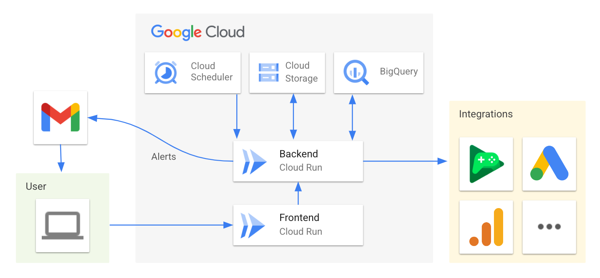

# AC Protect

## Table of Contents
- [Overview](#overview)
- [Prerequisites](#prerequisites)
- [Installation](#installation)
  - [Setup](#setup)
  - [Configuration Management](#configuration-management)
- [Alert Rules](#alert-rules)
- [Architecture](#architecture)
- [Usage](#usage)
  - [Monitoring](#monitoring)
  - [Configuration Management](#configuration-management-1)
- [License](#license)
- [Disclaimer](#disclaimer)

## Overview

### Purpose
Alert marketing teams of potential conversion losses in their App Campaigns caused by implementation issues.

### Background
The setup of App campaigns relies on various Google and non-Google systems such as Firebase, Google Analytics,
Google Play, and third-party attribution partners, as well as server-to-server (s2s) flows. Due to the integration with multiple systems, these campaigns are prone to malfunctioning due to incorrect implementations.

When an implementation issue occurs, it can be difficult for marketers to detect. Due to the nature of app campaigns, a
marketer may only realize that a campaign is underperforming after several days - app version adoption is usually gradual,
and the algorithm continues to optimize the campaigns, causing a gradual decline in performance.

These days of underperforming campaigns can lead to substantial costs and lost opportunities for the marketer.

## Prerequisites
AC Protect runs on Google Cloud and requires access to several Google APIs. To deploy the solution you need:
- Google Cloud Project with billing enabled
- Google Ads Developer Token
- Google Ads Client customer ID
- OAuth2 credentials:
  - Client ID and client secret
  - Refresh token with the following scopes:
    - https://www.googleapis.com/auth/cloud-platform
    - https://www.googleapis.com/auth/analytics.readonly
    - https://www.googleapis.com/auth/adwords
    - https://www.googleapis.com/auth/gmail.send
    - https://www.googleapis.com/auth/userinfo.email
    - https://www.googleapis.com/auth/androidpublisher (optional, for Android apps)
- OAuth Consent Screen configured with:
  - Redirect URI: https://sdk.cloud.google.com/authcode.html

For help with OAuth setup, follow this guide: https://github.com/google-marketing-solutions/credentials_creator_walkthrough

## Installation
### Setup
1. Clone this repository
2. Run `./deploy.sh deploy_all`
3. Configure the apps you want to monitor in the AC Protect frontend (a url will be outputted after deploying)

### Configuration Management
AC Protect provides a web interface for managing your monitoring setup:
1. Access the AC Protect frontend at your deployed URL
2. Use the interface to:
   - Add new apps for monitoring
   - Configure alert rules and thresholds
   - Manage email recipients
   - Update API credentials
   - Review existing configurations

## Alert Rules
AC Protect includes built-in rules to detect implementation issues:

#### Interval Events Rule
Monitors for missing conversion events within a specified time interval.
- Triggers when a conversion event that was previously tracked stops appearing in the data.
- Default interval: 24 hours

#### Version Events Rule
Monitors conversion events across app versions to detect implementation regressions.
- Triggers when conversion events present in a previous version are missing in the current version.
- Supports both iOS (App Store) and Android (Play Store) apps

Each alert includes:
- App ID affected
- Type of alert triggered
- Specific details about the missing events
- Timestamp of detection
- Version information (for version-related alerts)

Configure alert recipients through the AC Protect frontend interface.

## Architecture
AC Protect runs on Google Cloud Platform with the following components:
- Cloud Scheduler triggers a daily Cloud Run job
- Cloud Run executes the orchestrator function which:
  - Retrieves configurations from Cloud Storage
  - Collects data from resources such asGoogle Ads and Google Analytics
  - Stores raw data in BigQuery
  - Processes alert rules
  - Sends email notifications when issues are detected

## Usage
### Monitoring
#### Alert Emails
AC Protect sends email notifications only when implementation issues are detected. Each alert includes:
- App ID affected
- Types of alerts triggered
- Detailed information about each alert:
  - Specific implementation problems detected
  - Relevant metrics and data points
  - Timestamp of detection

#### BigQuery Monitoring
Monitor system data through BigQuery tables:
- `raw_data`: Contains collected data from various sources
- `alerts`: Stores generated alerts and their status

### Configuration Management
Manage your monitoring setup through the AC Protect frontend interface:
- Add/remove apps for monitoring
- Adjust alert thresholds
- Update notification recipients
- Review monitoring configurations

## License
Licensed under the Apache License, Version 2.0 (the "License");
you may not use this file except in compliance with the License.
You may obtain a copy of the License at
https://www.apache.org/licenses/LICENSE-2.0

## Disclaimer
This is not an officially supported Google product.
